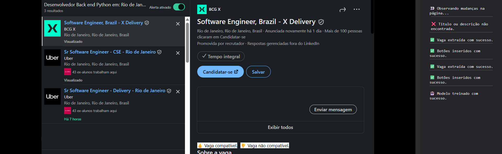
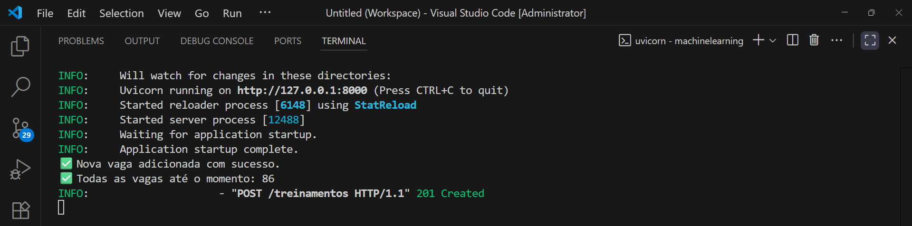
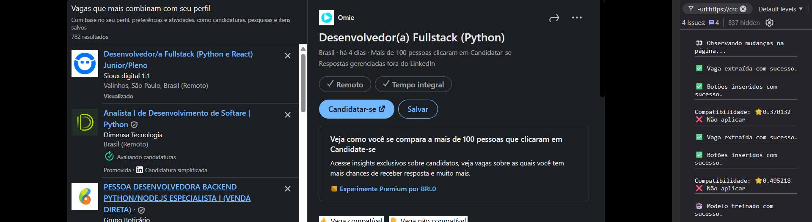

## 🧠 LinkedIn Job Matcher - Machine Learning
- O sistema nasceu com o objetivo simples de reduzir o tempo gasto analisando vagas de emprego manualmente.
- Foi desenvolvido em três abordagens diferentes até chegar à solução que resolveu o problema.

### 🏗️ ARQUITETURA & TECNOLOGIAS
- **API REST (FastAPI)** - Modelando URLs por recurso, verbos HTTP e statuscode.
- **Validação Input (Pydantic)** - Validação automática dos inputs de entrada utilizando DTOs.
- **Service (Scikit-learn)** - Scikit-learn TF-IDF para vetorizar e Logistic Regression para classificar/comparar.
- **Persistência (Joblib)** - Transformando objetos em bytes e armazenando em arquivo.
- **Testes (Pytest)** - Testes unitários com mocks para isolamento da lógica.
- **Frontend Integration (JavaScript + Tampermonkey)** - Extração de dados do LinkedIn e comunicação com a API.
- **Middleware (Exceptions)** - Tratamento centralizado para evitar acoplamento.

### 🤗 HUGGING FACE
- Primeiro, tentei utilizar modelos prontos hospedados via API, com implementação rápida e sem necessidade de infraestrutura pesada. Funcionou bem até eu perceber que não conseguiria enviar muitas vagas devido ao limite de tokens.
- Não tive dificuldades na implementação, só precisei entender como construir chamadas e prompt. Entendi muito melhor a frase "LLMs não são determinísticas" construindo esses prompts.
- Particularmente o código dessa tentativa esta bem feio.

### 🦙 OLLAMA - LLM LOCAL
- Quando entendi que o Hugging Face não daria certo, descobri que eu poderia utilizar modelos localmente, ou seja, uma LLM offline na minha máquina.
- Teria funcionado perfeitamente, e muito melhor que minha última tentativa, porém minha máquina não tem uma boa GPU ou RAM.
- Os modelos que rodavam eram muito ruins ou quando acertavam demoravam uma eternidade. Tentei fazer usando um único prompt e também quebrando em etapas, mas não adiantou, então se tornou inviável.
- Entendi mais profundamente o que são parâmetros, contexto, como agentes funcionam em loops, que nada é mágico, que o prompt é probabilístico e não determinístico, e que preciso manter um prompt estruturado se quiser obter uma boa resposta.
- Outro código que particularmente achei bem feio.

### 🤖 MACHINE LEARNING
- Foi a solução que encontrei. No momento que escrevo isso, não entendo muito profundamente todas os aspectos do ML, mas entendo meu código e meu objetivo.
- Preciso resolver um problema binário, aplicar ou não aplicar, então é um problema de classificação. A solução foi utilizando TF-IDF para vetorizar os textos e Logistic Regression para classificar de fato.
- Nenhum custo, praticamente nenhuma latência, e o problema foi resolvido. É claro, não é tão dinâmico quanto eu queria ao usar LLMs, mas resolve o problema.
- Comparado aos outros códigos, a evolução é clara e o código de fato me agrada. Modularizado e organizado, como deve ser, utilizando POO, DTOs, DIs, DDD, Middleware e Testes.
- Agora tenho um sistema de recomendação pessoal que se torna cada vez mais assertivo com o tempo.

### 🚀 MELHORIAS FUTURAS
- Race Conditions / Controle de Concorrência
- Exibir score da vaga no DOM.

### 📚 CONCLUSÃO E CRÉDITOS
- Desenvolvido por **Leandro R. Martins**

### 📸 IMAGENS

